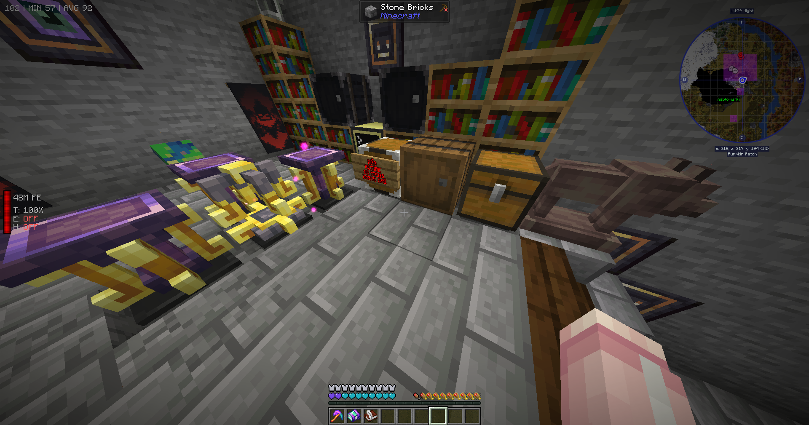

## Ars Nouveau Essence Autocraft

- Automation prepared to use `AppliedEnergistics 2`, use blocking mode on `Pattern Provider`.
- Need to connect inventory buffers for input, output and craft buffer using wired modems.

