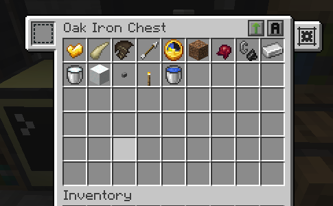

## Ars Nouveau Essence Autocraft

- Automation prepared to use `AppliedEnergistics 2`, use blocking mode on `Pattern Provider`.
- Need to connect inventory buffers for input, output and craft buffer using wired modems.
- Key items, you need to create the AE2 patterns using `1 Source Gem` and `1 Key item`:
  - Gunpowder
  - Kelp
  - Redstone Dust
  - Book
  - Feather
  - Sugar
  - Wheat Seeds

Basic setup with 3 inventories, 1 Advanced computer, 1 Ars Nouveau Imbuement Chamber setup.

Items that are necessary to be in the buffer for this craft automation works.

